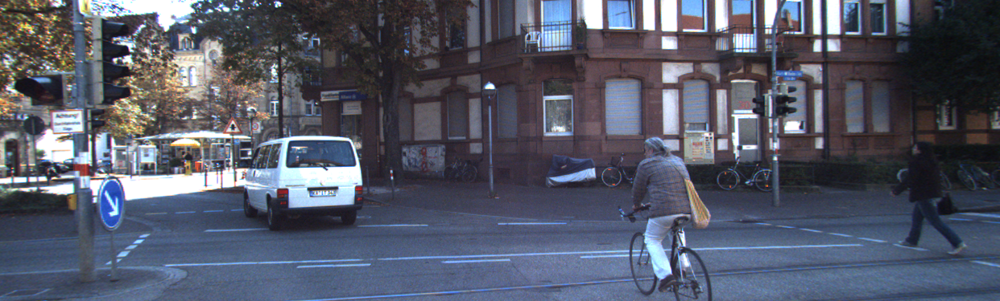
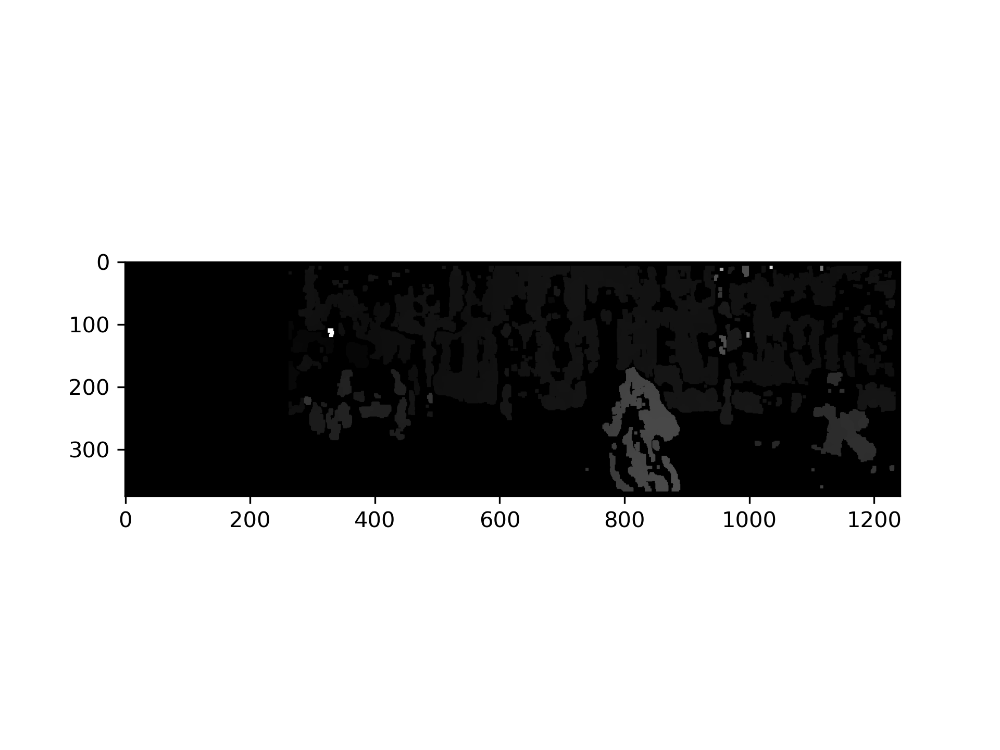

depth image from stereo camera
===============================
using kitti dataset
-------------------

스테레오로 촬영된 두개의 이미지에서 depth정보를 추출하고
opening filter를 통해 noise를 제거하는 코드입니다.

left image
----------

right image
-----------

result
------

